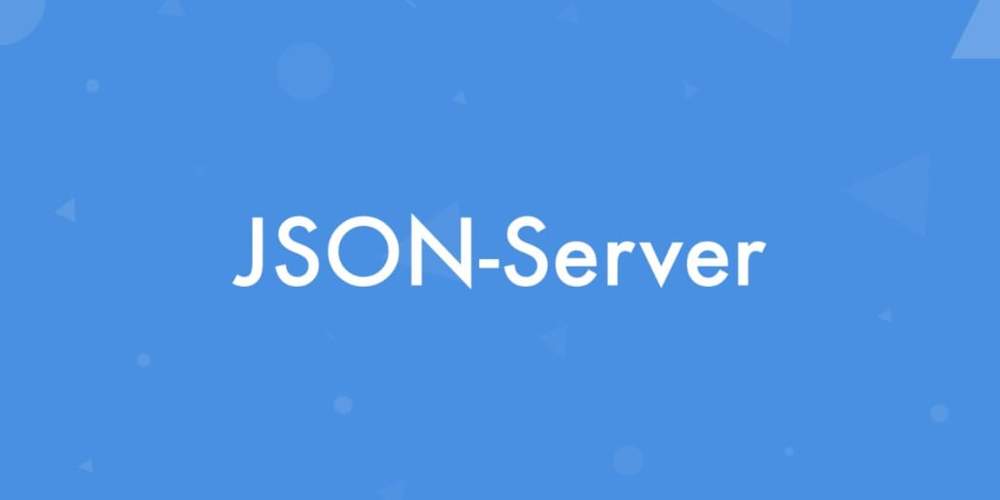

<h1 align="center">JSON SERVER (HTML, CSS & Javascript)</h1>

    

    
    
    

    This repo is talk about JSON-Server that is another way to store data besides using the database that we usually use like MySql / Postgres / MongoDB. JSON Server is good for front-end developers who need a quick back-end for prototyping and mocking. This appllication is for exercise purpose to make me understand about how JSON-Server work and connect it with REST API. In this repo i am use HTML for UI, CSS for styling and javascript for logic and also json-server that i am install global in my computer.

## Features

<b> Main Page ( index.html ) </b>

- Get All data from database ( METHOD: GET )
- Sort data by ( Popular, Unpopular, Newest, Oldest )
- Search data by term

<b> Create Page ( create.html ) </b>

- Add new data ( METHOD: POST )

<b> Detail Page ( details.html ) </b>

- Get data from database by ID ( METHOD: GET )
- Delete data from database by ID ( METHOD: DELETE )
- Button like ( METHOD: UPDATE )
- Button dislike ( METHOD: UPDATE )

## How To Install

1. Git clone [Json Server](https://github.com/aldoignatachandra/RegEx-Checking) or download zip.
2. Open in your code editor (vscode, atom or other).
3. Install globally [json-server](https://www.npmjs.com/package/json-server) package to your computer.
4. To start the server you can type in the terminal like this (json-server --watch data/db.json).
5. db.json is optional, you can name the json file to store data any name you want.
6. To start the HTML file for UI (index.html) i use extension (live server) in vscode.

## Screenshot from the App

  
      <image width="600" src="screenshot/Screenshot_1.png" />
      <image width="600" src="screenshot/Screenshot_2.png" />
      <image width="600" src="screenshot/Screenshot_3.png" />
  

## License

[ISC](https://en.wikipedia.org/wiki/ISC_license "ISC")
